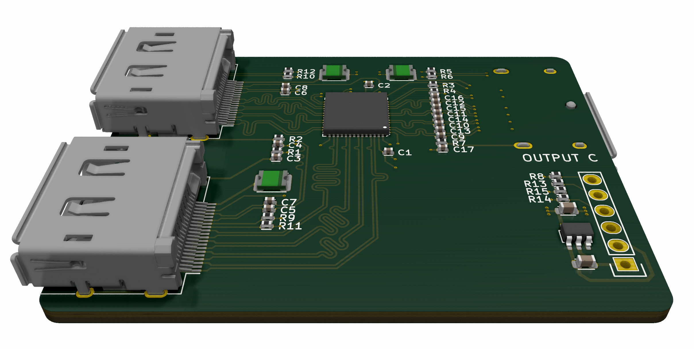

# DisplayPort Switch

Simple board to provide DisplayPort >1.2 source selection control.

While not explicitly designed for a particular direction, the intent is usage with 2 video sources (different computers) and a single sink (one monitor).

## Notes

- Switching is provided externally through the header.
- As this board is a prototype, there's no guarantee of stability or reliability.

- The planned enclosure method is to wrap the board with heatshrink and let it 'hang' in the display cable bundle.

